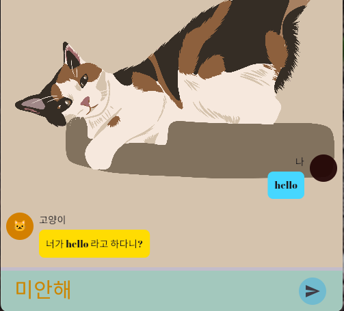

## 고양이와 대화하는 LLM 기반 게임🐈‍⬛
고양이는 사실 사람의 말을 조금 할 μ 있습니다. 평소에 μ 하지는 않습니다. 
이 앱에서는, 고양이가 사람과 말을 해줍니다. 
Flutter로 android, ios 플랫폼으로 만들 것입니다. llm 모델을 파인튜닝 rag 등으로 수정할 예정입니다. 

아직 개발 중입니다....ㅎㅎ
